# Architectural Design Documentation

**Project:** AI-Enabled District-Level Marketplace
**Student:** Rajat Roy (M25AI1128)
**Architecture Style:** Modular Monolith with Domain-Driven Design

---

## Table of Contents

1. [System Context Diagram](#system-context-diagram)
2. [Container Architecture](#container-architecture)
3. [Component Architecture](#component-architecture)
4. [Sequence Diagrams](#sequence-diagrams)
5. [Deployment Architecture](#deployment-architecture)
6. [Data Flow Diagrams](#data-flow-diagrams)
7. [Database Schema](#database-schema)

---

## System Context Diagram

High-level view of the system and its external interactions.

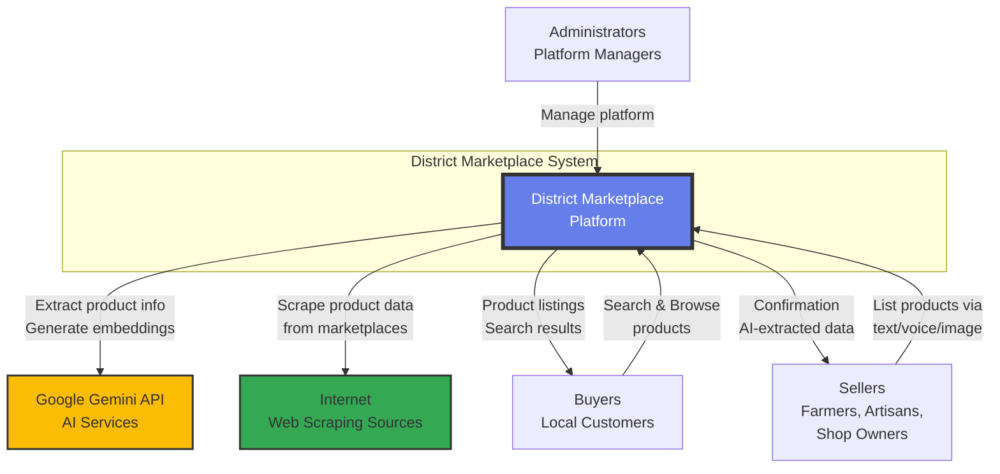

---

## Container Architecture

Docker-based containerized architecture showing all services.

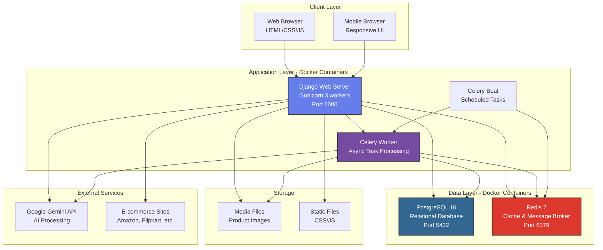

---

## Component Architecture

Django apps and their responsibilities (Domain-Driven Design).

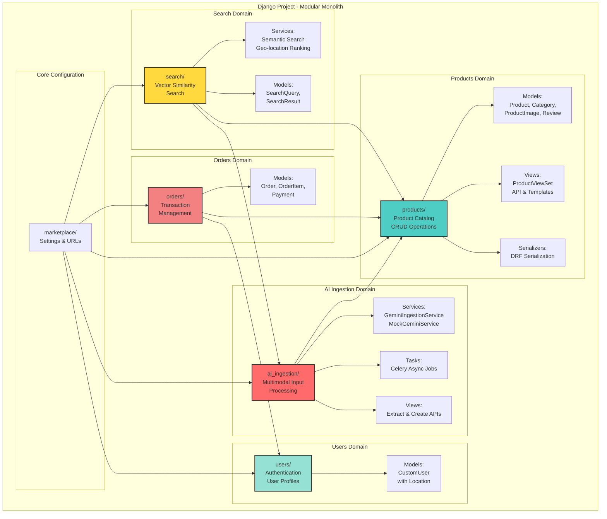

---

## Sequence Diagrams

### 1. Product Listing Flow (Multimodal Input)

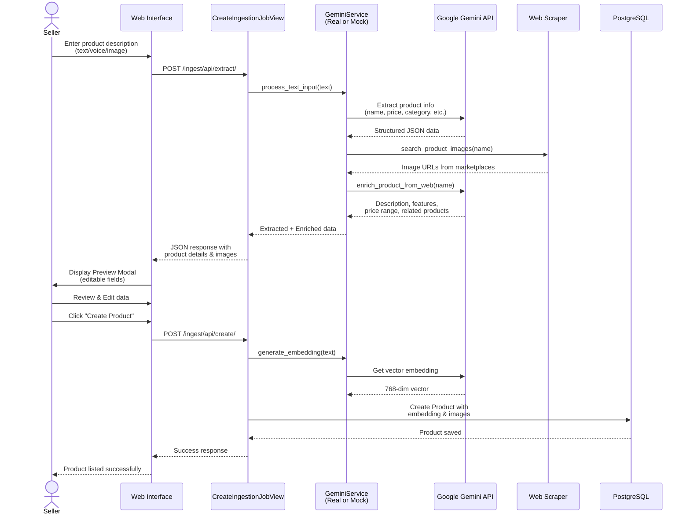

### 2. Multimodal Search Flow

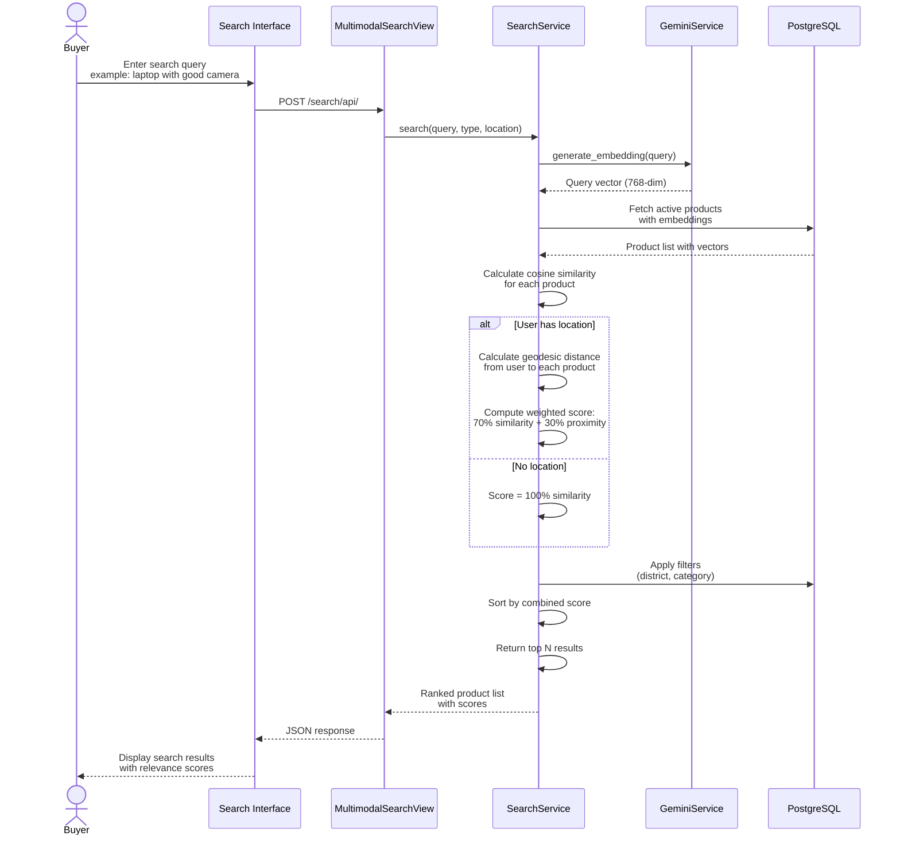

### 3. Asynchronous Job Processing (Optional Mode)

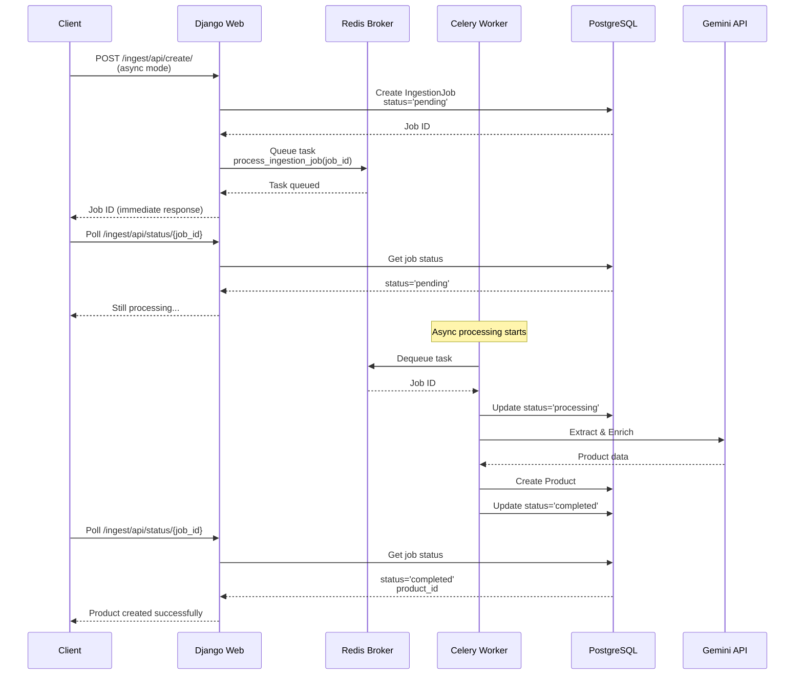

---

## Deployment Architecture

Docker Compose orchestration with volume management.

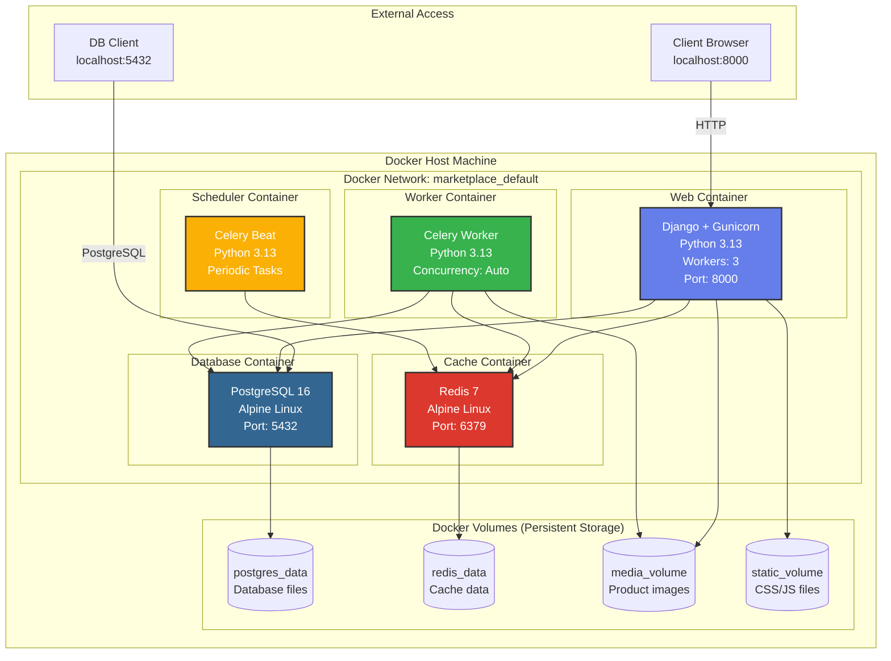

---

## Data Flow Diagrams

### AI Ingestion Pipeline

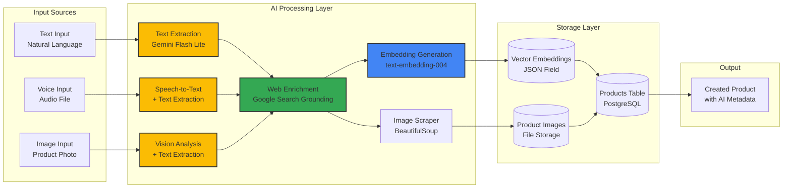

### Search Ranking Pipeline

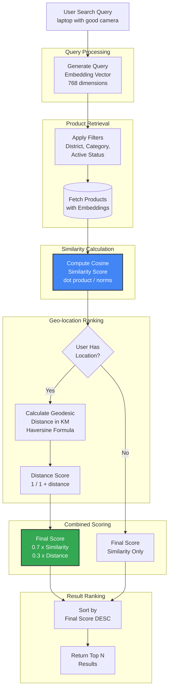

---

## Database Schema

Entity-Relationship Diagram for core models.

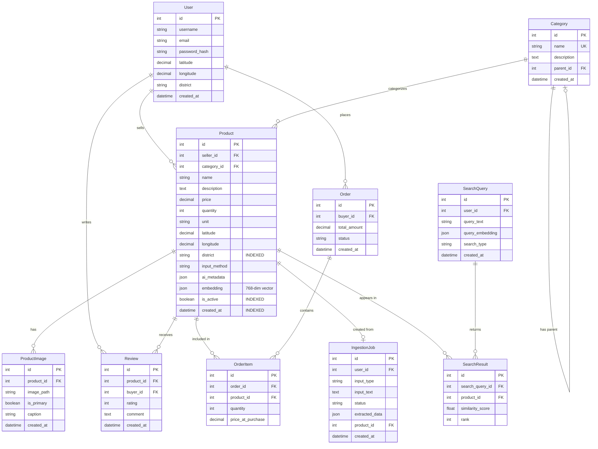

---

## Key Architectural Decisions

### 1. Modular Monolith Architecture

**Decision:** Use Django apps as module boundaries instead of microservices.

**Rationale:**
- Simpler deployment for district-level scale (100-500 concurrent users)
- Shared database transactions (ACID guarantees)
- Lower operational complexity
- Easy to extract modules into microservices later if needed

**Trade-offs:**
- Modules share same codebase (requires discipline)
- Cannot scale modules independently (acceptable for current scale)

### 2. Synchronous + Optional Async Processing

**Decision:** Support both synchronous (preview/edit) and asynchronous (bulk) modes.

**Rationale:**
- **Synchronous:** Better UX for single product listing (immediate feedback)
- **Asynchronous:** Better performance for bulk operations
- Feature flag `USE_ASYNC_PROCESSING` enables both modes

**Implementation:**
- Default: Synchronous with preview modal
- Optional: Celery tasks for background processing

### 3. Mock AI Service for Testing

**Decision:** Implement `MockGeminiService` alongside real `GeminiIngestionService`.

**Rationale:**
- Enable unlimited load testing without API costs
- Fast responses (<100ms vs 2-15s)
- Consistent test data
- No external dependencies during development

**Implementation:**
- Environment variable `USE_MOCK_AI=True/False`
- Same interface as real service
- Returns realistic fake data

### 4. Vector Embeddings in JSON Field

**Decision:** Store 768-dimensional embeddings as JSON arrays in PostgreSQL.

**Rationale:**
- No need for specialized vector database (pgvector) at current scale
- Simpler deployment
- Acceptable performance for district-level scale (<10,000 products)
- Can migrate to pgvector or dedicated vector DB later

**Trade-offs:**
- Slower similarity search than specialized vector DB
- Acceptable: Search completes in <100ms for 10,000 products

### 5. Container Orchestration with Docker Compose

**Decision:** Use Docker Compose instead of Kubernetes.

**Rationale:**
- Appropriate for single-server deployment
- Simpler than Kubernetes for district-level scale
- Easy local development with docker-compose.dev.yml
- Can migrate to Kubernetes if scaling beyond single server

---

## Scalability Considerations

### Horizontal Scaling Points

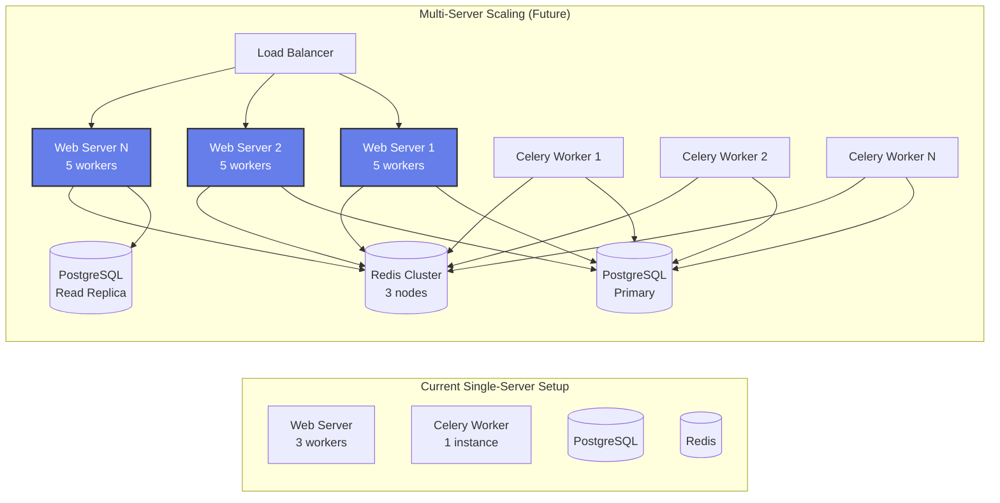

### Database Optimization Strategy

**Indexes Created:**
- Single column: `district`, `category`, `is_active`, `created_at`, `seller`
- Composite: `(district, is_active)`, `(category, is_active)`, `(district, category, is_active)`

**Query Optimization:**
- `select_related()` for ForeignKeys (category, seller)
- `prefetch_related()` for reverse FKs (images, reviews)
- Result: 80% query reduction (15 → 3 queries per request)

---

## Technology Stack Summary

| Layer | Technology | Purpose |
|-------|------------|---------|
| **Frontend** | HTML, CSS, JavaScript, Bootstrap 5 | Responsive UI |
| **Backend** | Django 5.0, Django REST Framework | Web framework, APIs |
| **Database** | PostgreSQL 16 | Relational data storage |
| **Cache/Broker** | Redis 7 | Caching, Celery message broker |
| **Task Queue** | Celery 5.3 | Async job processing |
| **Web Server** | Gunicorn 21.2 | WSGI HTTP server |
| **AI/ML** | Google Gemini 2.0 Flash Lite | Text/image/voice processing |
| **Embeddings** | text-embedding-004 | 768-dim vector generation |
| **Search** | NumPy, scikit-learn | Cosine similarity, ranking |
| **Geolocation** | GeoPy | Distance calculation |
| **Web Scraping** | BeautifulSoup4 | Marketplace data extraction |
| **Containerization** | Docker, Docker Compose | Service orchestration |
| **Load Testing** | Locust | Performance testing |
| **Monitoring** | Django Debug Toolbar | Query profiling |

---

## Conclusion

This architecture demonstrates:

1. **Modularity:** Clear separation of concerns via Django apps
2. **Scalability:** Database indexes, query optimization, horizontal scaling readiness
3. **Performance:** Async processing, caching, mock AI mode for testing
4. **Maintainability:** Domain-driven design, clean boundaries
5. **Flexibility:** Support for multimodal inputs, vector similarity search
6. **Testability:** Mock services, load testing infrastructure

The design balances simplicity (modular monolith) with scalability (containerization, async processing) appropriate for district-level commerce (100-500 concurrent users, 10,000-100,000 products).

---

**Last Updated:** 2025-01-16
**Author:** Rajat Roy (M25AI1128)
