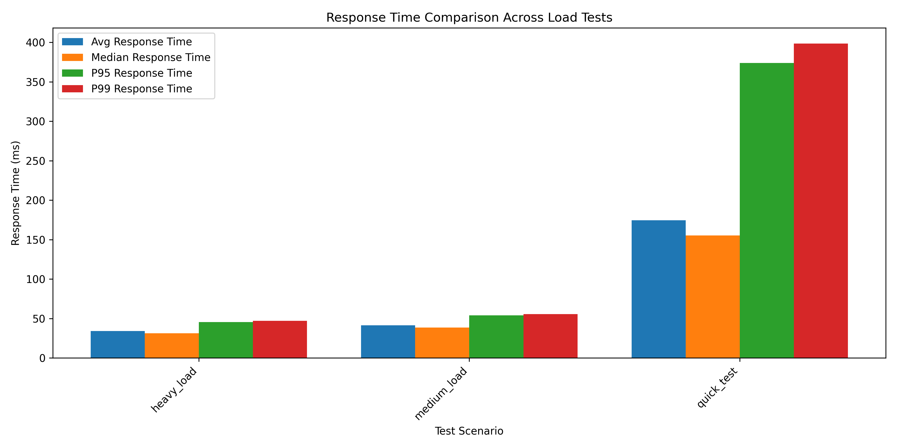
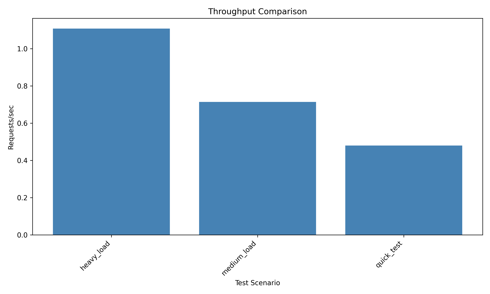
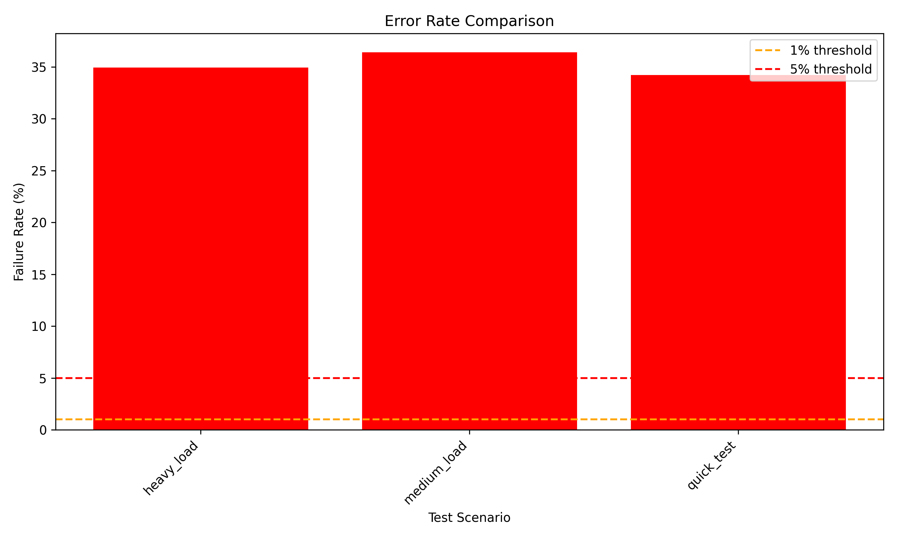

# Load Test Performance Report

## Summary

This report contains performance metrics from load testing the District Marketplace.

## Test Scenarios

### Heavy Load

| Metric | Value |
|--------|-------|
| Total Requests | 6298 |
| Total Failures | 2200 |
| Failure Rate (%) | 34.93 |
| Avg Response Time (ms) | 34.02 |
| Median Response Time (ms) | 31.14 |
| P95 Response Time (ms) | 45.29 |
| P99 Response Time (ms) | 47.15 |
| Min Response Time (ms) | 1.02 |
| Max Response Time (ms) | 1011.96 |
| Requests/sec | 1.11 |

### Medium Load

| Metric | Value |
|--------|-------|
| Total Requests | 3126 |
| Total Failures | 1138 |
| Failure Rate (%) | 36.40 |
| Avg Response Time (ms) | 41.34 |
| Median Response Time (ms) | 38.59 |
| P95 Response Time (ms) | 53.96 |
| P99 Response Time (ms) | 55.69 |
| Min Response Time (ms) | 1.14 |
| Max Response Time (ms) | 905.19 |
| Requests/sec | 0.71 |

### Quick Test

| Metric | Value |
|--------|-------|
| Total Requests | 298 |
| Total Failures | 102 |
| Failure Rate (%) | 34.23 |
| Avg Response Time (ms) | 174.50 |
| Median Response Time (ms) | 155.31 |
| P95 Response Time (ms) | 374.04 |
| P99 Response Time (ms) | 398.48 |
| Min Response Time (ms) | 1.45 |
| Max Response Time (ms) | 2757.53 |
| Requests/sec | 0.48 |

## Graphs

## Conclusions

### Performance Quality Attribute Proof

**Average Response Time:** 83 ms

**Average Throughput:** 0.77 requests/sec

**Average Failure Rate:** 35.19%

**Performance Target Met:** Average response time < 500ms

**Reliability Issue:** Failure rate > 5%

